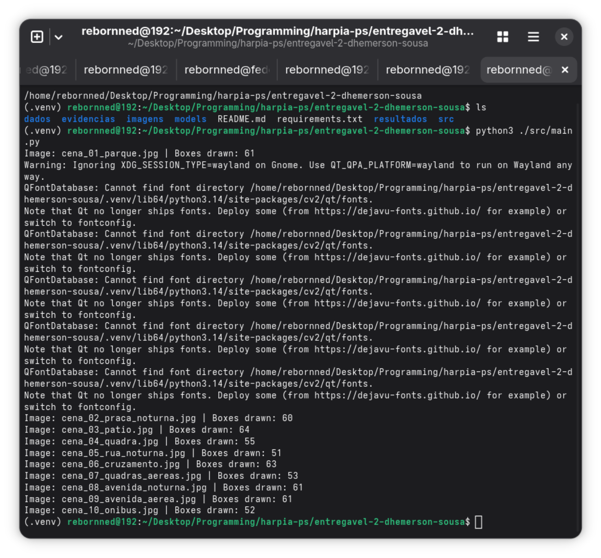

# Entregável 2 — Anotações de Imagens com OpenCV

Dhemerson Sousa

Processo seletivo de extensão da UFRJ (Harpia), Fase 2 — "Aprendendo a ser um programador".



## Objetivo

Visualizador de anotações de bounding boxes em Python. O programa lê as anotações de `dados/anotacoes.csv`, converte cada linha em objetos (`Deteccao` e `ImagemAnotada`), e usa OpenCV para desenhar as caixas sobre as dez imagens fornecidas em `imagens/`, exibindo uma por vez em uma janela navegável. Cada imagem anotada é salva em `resultados/`, mantendo o nome e a resolução originais.

Na prática, esse tipo de ferramenta serve para conferir visualmente a qualidade de um conjunto de anotações antes de usá-lo para treinar um modelo de detecção — é uma etapa comum de verificação de dados em pipelines de visão computacional.

## Requisitos

- Python 3 instalado (testado via terminal Linux ou WSL, com suporte a janelas gráficas)
- `opencv-python`, listado em `requirements.txt`

## Como executar

A partir da raiz do repositório:

```bash
python3 -m venv .venv
source .venv/bin/activate
python -m pip install -r requirements.txt
python src/main.py
```

O programa lê `dados/anotacoes.csv`, agrupa as caixas por imagem e abre a primeira imagem (em ordem alfabética) em uma janela do OpenCV. A cada imagem, o terminal mostra o nome do arquivo e a quantidade de caixas desenhadas.

## Controles do visualizador

| Tecla | Ação |
|---|---|
| Espaço | Avança para a próxima imagem |
| `q` | Encerra o programa (as imagens ainda não processadas não são salvas) |
| Qualquer outra | Mantém a imagem atual na tela |

Ao final das dez imagens, ou ao pressionar `q`, as janelas são fechadas automaticamente.

## Sobre as classes

O CSV traz duas classes de objeto, identificadas apenas pelo `classe_id` (0 ou 1), sem rótulo textual — o programa não interpreta o que cada uma representa, só diferencia visualmente:

- **Classe 0** — desenhada em verde.
- **Classe 1** — desenhada em azul.

A legenda no canto superior esquerdo de cada janela relaciona as cores aos IDs.

## Estrutura

```
.
├── dados/
│   └── anotacoes.csv          # anotações fornecidas (imagem, classe_id, x_min, y_min, x_max, y_max)
├── imagens/                    # as dez imagens originais fornecidas
├── resultados/                 # imagens anotadas geradas pela execução
├── evidencias/
│   ├── terminal.png            # captura da execução no terminal
│   └── visualizador.png        # captura de uma janela com as caixas visíveis
├── src/
│   ├── main.py                 # ponto de entrada: loop de visualização, validação e salvamento
│   ├── modelos.py               # classes Deteccao e ImagemAnotada
│   └── arquivos.py              # leitura e agrupamento do CSV
├── requirements.txt
└── README.md
```
